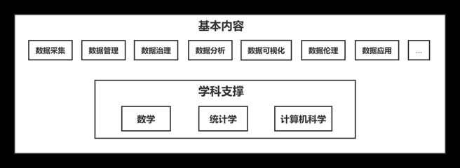
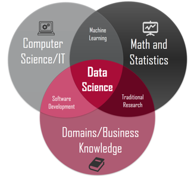

## 目录

\tableofcontents

# 准备工作

## 数据科学

* 数据科学是一门交叉学科，主要研究如何利用科学的方法、过程、算法或系统，从结构化的或非结构化的数据中提炼知识、洞察规律、获得见解，基本内涵：

  1. 用数据的方法研究科学问题。在科学研究的历史长河中，经过多年的发展，形成了从实验归纳到模型推演，再到计算机仿真的三种科学研究范式。在如今这个数据爆炸的时代，数据驱动来推进相关原理和方法发现的科学研究方法被称为科学研究的第四范式，比如生物信息学、天体信息学等等。

  2. 用科学的方法研究数据。我们对于数据的研究不是靠经验或者感觉，而是把数据的研究看作一个具有生命周期的过程，包含数据的采集、管理、分析，到可视化呈现，以及数据如何进行有效的治理，甚至数据的分析过程是不是涉及伦理问题等，都采用一种科学的方法来进行研究。这就是数据科学的另一层含义，用科学的方法研究数据。
  

## 数据的方法研究科学

* 科学研究的第四范式也称作数据密集型科学。它是将海量数据放入庞大的计算机集群中，只要数据间存在着一定的相互关系，那么就能找到相应的模型和算法，来发现传统的科学方法发现不了的新模式、新知识，甚至是新规律。

* 数据科学对科学研究产生了重要的影响，当前它已经成为科研体系的重要组成部分。随着未来的发展，它将取得与物理、化学、生命科学等自然学科同等重要的地位。数据科学也促使科学研究与市场产业、行业的联系更加密切，缩短了从基本原理的发现，到产生经济效益的产业化的周期。除此之外，数据科学相关的研究和应用，与社会的发展以及人们日常生活的联系也将会越来越紧密。


## 科学的方法研究数据

* 数据科学在数学、统计学、计算机科学的多学科的支撑下，从数据采集、数据管理、数据治理、数据分析、数据可视化、数据伦理等众多的方面来开展科学的研究，涵盖了数据全生命周期的流程和相应的处理链条。

{ width="70%" }

## 具体内容

* 数据采集：借助相关的技术和手段来进行数据的收集；通过将收集的数据存储在介质中，来对数据进行管理和维护；
* 数据治理：通过对数据进行有效的组织，可以有效提升数据的质量，以便为后面的分析过程提供更好、更可用的数据；
* 数据分析：在数据分析环节，通过对数据进行详细的研究和概括总结，提炼有价值的信息来洞察规律，是最为**重要的环节**；
* 数据可视化：数据可视化，就是指运用图形、图表等多种有效的可视化方法来展示数据，以便更清晰明确地传递数据中所蕴含的价值，也帮助人们更好的理解数据。
* 数据安全：在分析和运用数据的过程中，是否会产生数据安全问题？是否会侵犯用户的隐私？用算法得出的结论，是否会对特定群体产生不公平现象？是否会存在认知上的偏见？这都是数据伦理问题。
* 数据应用：通过对数据的分析，得出的知识、见解、原理，或者是相关关系，必将对相关的行业领域产生影响，也为相关的领域带来应用价值。

## 数据科学：交叉学科

* 数据科学是一门交叉学科，德鲁·康为（Drew Conway）的韦恩图展示了数据科学多学科交叉的特性。
{ width="70%" }

## 大数据

* “大数据”（Big Data）这个词近年来十分火爆。大数据是指无法在一定时间内用常规的软件工具对其内容进行获取、管理和处理的海量数据的集合。大数据具有“5V”特性：

+ 规模性（Volume）：形容数据量非常大。
+ 多样性（Variety）：指数据的类型众多，有结构化的，也有非结构化的。
+ 高速性（Velocity）：是指数据产生的速度非常快。由于在我们的日常生活中，每天都会快速产生大量的数据，所以要求我们处理数据的能力要强、处理的速度要快，这样才能快速发现数据中的价值。
+ 真实性（Veracity）：指的是从互联网或是智能传感器等数据收集工具得到的数据，是人们真实行为的一个体现，通过对这些数据的分析，可以洞察人们的行为规律。
+ 价值性（Value）：指的是大数据的价值密度低。价值隐藏在海量的数据中，我们要通过分析挖掘才能得到这样的价值。
* 这就是大数据的“5V”特性。


## 数据科学与大数据

* 数据科学是一门以数据，尤其是大数据作为研究对象的学科。大数据最大的特点就是数据的规模大，而数据科学本身它并不强调数据规模的大小，在大数据出现之前，数据科学也有着广泛的应用。


* 针对大数据所带来的这种挑战，数据科学更拥有了用武之地，它为在海量的数据中挖掘价值，构建相应的规律，提供了新的思维、新的思路和新的方法。


## 图

上一张幻灯片的图片太大了。我们可以使用
`{ width="40%" }`将图片缩小为原来的40%，如下所示。需要注意的是
`width=40%`跟左右大括号之间必须有空格。

{ width="40%" }

## 表

在markdown中插入表格比在LaTeX中简单很多。
比如在下面的表格中：第一行表示每一列的名字，用竖线隔开；
第二行表示对齐方式，`:---`是左对齐，`---:`是右对齐，`:---:`是居中对齐。从第三行开始，是具体的数据，每一行表示一个人，每一列表示对应变量的具体取值。

| 姓名 | 性别 | 年龄 |
|:---:|:---:|:----:|
| 张三 | 男 | 21 |
| 小白 | 女 | 20 |
| 王五 | 男 | 45 |

如果表格太长，可以在 [LaTeX Tables Online](https://tablesgenerator.com/) 网站上将
Excel表格转成上述markdown格式，再复制粘贴即可。

## 超链接

要插入超链接，使用`[]()`，其中()中是网址，[]中是超链接的名字。比如 [必应](www.bing.com)。在生成的pdf中点“必应”就可以跳转到对应网址。需要注意[]与左边的文字之间必须要有空格。

## 数学符号

跟LaTeX完全一致，如果需要在句子中插入数学符号或者式子，比如
$x_1$，就左右各用一个美元符号。如果是要空出一行单独显示式子，比如：

$$ x_1+x_2=y $$
就空出一行，并且左右各用两个美元符号。

## 分级标题

在每一页幻灯片中，可以分别用 * + - 生成不同级别的 item，注意缩进，注意符号后要有一个空格，例如：

* 中国
    + 广东
        - 广州
        - 深圳
    + 湖南
        - 长沙
        
## 分级标题

如果需要枚举，用“数字.”代替上面的 * + - 即可，注意“.”之后要有空格，例如：

* 中国
    + 广东
        1. 广州
        2. 深圳
    + 湖南
        1. 长沙

## R代码及结果

可以在beamer中插入R代码及其运行结果，例如：

```{r echo=TRUE, message=FALSE, warning=FALSE, paged.print=FALSE}
a = 2
a
```

## R代码及结果

值得注意的是，整份Rmd文件中的R代码是有前后顺序的。比如我们在上一页定义a取值为2，在后面的代码中，只要这一变量没有被覆盖定义，这一结果依然有效。例如：

```{r echo=TRUE, message=FALSE, warning=FALSE, paged.print=FALSE}
a+3 # a=2
a^2 # a=2
a = 5 # 重新定义
a
```

## \quad

\center{\LARGE{谢 \quad 谢！}}
